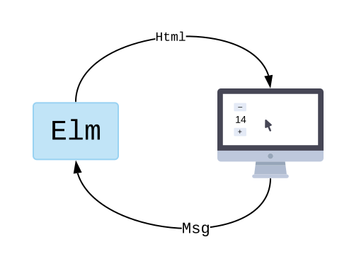

<!-- _class: lead -->

# Svelm

Was in bei elm gelernt habe und in sevelte weiter nutzen möchte.

---

# Wer spricht?

- Dennis Roch
- Bei Tag Backenddeveloper in den Wolken (Stadtsalat seit diesem Jahr)
- In der Nacht / am Wochenende Fullhobbyprojektentwickler (Seit ~4 Jahren)

---

# Agenda

1. Überblick Themen
1. Einführung Elm (ohne Syntax)
1. Hallo Elm und Anpassungen (web livecode)
1. Hallo Elm-land als Framework (local livecode)
1. Techniken die auch in Svelte funktionieren
1. Anknüpfpunkte

<!--
Bei Fragen / Anmerkungen gerne unterbrechen
-->

---

# 1. Überblick

---

# 1. Überblick (In)

- TEA (The Elm Architecture)
- "sound typesystem"
- funktionale Sprache
- Mantras
- Ökosystem (der Teil, der nicht npm ist)

---

# 1. Überblick (Out)

- Syntax - kein Übertrag in Svelte
- virtual DOM - kein Übertrag in Svelte
- Javascript interop - svelte kann direkt Javascript nutzen
- Elm UI aka "Ich will web ohne CSS machen" - geht nur in elm

---

# 2. Einführung Elm

---

# 2.1 Einführung Elm - TEA

Auch bekannt als MVU (Model View Update)


Adaptiert z.B. von, elmish (F#), Redux (React/JS/TS) und weiteren

<!--
notes
-->

---

# 2.2 Einführung Elm - sound types 1

Stell dir vor, der Kompiler hat immer recht

- kein cast auf falschen typen
- kein unerwartetes null / undefined

---

# 2.2 Einführung Elm - sound types 2

Stell dir vor du kannst so modellieren, wie es in der echten Welt ist:

Beispiel ein Nutzer kann anonym sein oder angemeldet. Der angemeldete Nutzer hat einen Nutzernamen

---

# 2.3 Funktionale Sprache

Feedback im Chat: Wie gut kennst du dich mit funktionaler Programmierung aus?

1 noch nie gehört - 5 ich bin Haskell Entwickler

---

# 2.3 Funktionale Sprache - Eigenschaften

- unveränderlich
  - wenn x = 3, dann bleibt es 3
  - wenn Liste = [1,2,3], dann bleibt sie das auch
- verhersagbar
  - wenn eine Funktion die selben Eingaben bekommt, gibt sie die selben Ausgaben aus

<!-- Programmierparadigma gibt nicht, es nimmt -->

---

# 2.3 Funktionale Sprache - Fehlende Eigenschaften

- keine Änderungen von bestehendem
  - nichts ändern?
  - Kopie mit Änderung nutzen
- keine Seiteneffekte
  - Problem, kein IO -> später
  - Dafür fällt es uns und dem Kompiler leichter über Dinge nachzudenken
- => Garantien möglich

<!-- damit dann zu den Mantras  -->

---

# 2.4 Mantras - Impossible states

## Making impossible States impossible

- Vortrag von Richard Feldman
- Kardinalität betrachten
- Problem richtig modellieren ist die halbe Arbeit

Beispiel: 3 booleans für Eigenschaften, 8 Kombinationen, 5 gibt es, die anderen 3 hat niemand bedacht -> bug

Beispiel 2: Liste für Fragen, Liste für Antworten, Listen sind unterschiedlich lang? was nun?

---

# 2.4 Mantras - Parse don't validate

## Parse don't validate

- Validieren führt dazu, dass die daten durch das halbe System sind, bevor sie auf Sinnhaftigkeit geprüft werden
- Parsen schafft Wissen, nun kann der Typ aus der Domäne verwendet weren, statt überall etwas validieren zu müssen
- Vertraue keinen Daten, die das System betreten (Request, Response, Storage )

<!-- sound typesystem, kein cast

 -->

---

# 2.4. Mantras - If it compiles it works

## Shift left

- schaffe Vertrauen in den Prozess
- versuche so viele Garantien wie möglich in die build phase zu bringen
  - Typsystem
  - Compiler
  - "linter"

<!-- sound typesystem, kein cast

 -->

---

# 2.5 Ökosystem

- Aktuell: elm 19.1 release Datum 21.10.2019
- Die letzten Releases haben Features entfernt
- Weniger Pakete als npm, aber höhere Durchschnittsqualität
  - Gezwungene richtige semantic versions, wegen
    - keine Seiteneffekte
    - sound Typesystem

---

# 3 Hallo Elm

---

# 3 Hallo Elm livecoding Ziele

[ellie](http://ellie-app.com)

1. Zähler Beispiel angucken
1. Zurücksetzen implementieren
1. Auf 100 setzen implementieren

---

# 4 Hallo Elm-land

---

# 4 Hallo Elm-land livecoding Ziele

1. elm Land Projekt anlegen
2. Zähler aus ellie als /counter Seite anlegen
3. Zeitreise
4. Minimum und Maximum des Zählers anzeigen
5. Minimum und Maximum des Zählers als geteilten Zustand implementieren und auf Hauptseite anzeigen

<!-- npx elm-land init DIR
  npx elm-land add page PATH
  npx elm-land customize --help
  npx elm-land customize shared
  npx elm-land customize effect

 -->

---

# 5. Anknüpfpunkte

- lamdera
  - full stack elm
  - Evergreen migrations
- elm-ui
  - CSS ist doof ;-)

---

# 6 Techniken für Svelte

- Union Types
- exhaustive switch
- Parse (Bespiel Zod)
- ...

```

```
